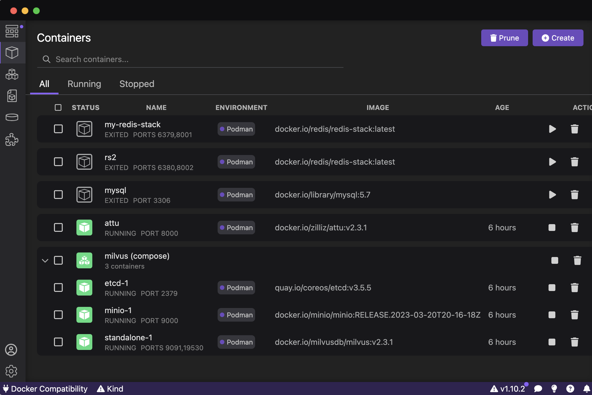

# Spring AI + Ollama + Milvus实现的一个简单的问答系统

## milvus podman本地安装

* [安装部署milvus单机版](https://blog.csdn.net/shulu/article/details/134260624)
* [docker 安装向量数据库 Milvus](https://blog.csdn.net/chy555chy/article/details/131658058)
attu管理界面要使用电脑实际ip进行连接，不能使用localhost和127.0.0.1



## Ollama本地安装

目前使用的大模型是llama3

## 项目运行

### 1. 数据入库

### 2. 查询

## 遇到问题

1. 当前版本spring AI（0.8.1）不支持milvus向量索引维度大小(dimension)超过2048。
解决办法：手动在milvus中创建数据库索引维度大小设置为4096,llama3 embedding后维度为4096
2. spring restClient超时设置
```
    @Bean
    @Scope("prototype")
    RestClient.Builder restClientBuilder(RestClientBuilderConfigurer restClientBuilderConfigurer) {
        ClientHttpRequestFactorySettings settings = new ClientHttpRequestFactorySettings(Duration.ofSeconds(30),Duration.ofSeconds(30),null, null);
        RestClient.Builder builder = RestClient.builder()
                .requestFactory(ClientHttpRequestFactories.get(settings));
        return restClientBuilderConfigurer.configure(builder);
    }
```
